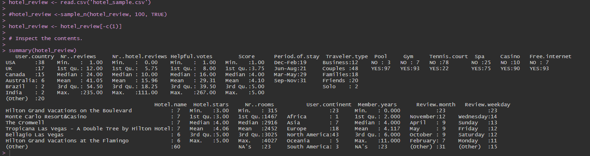
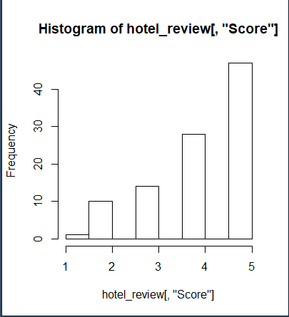
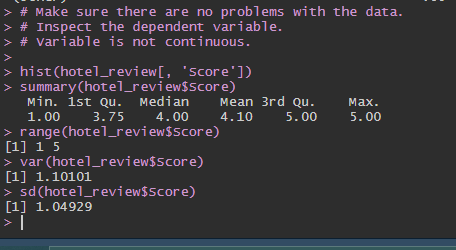
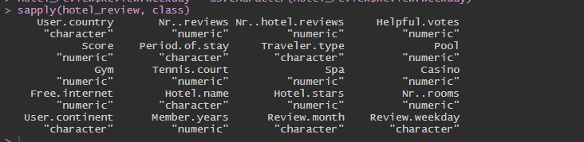
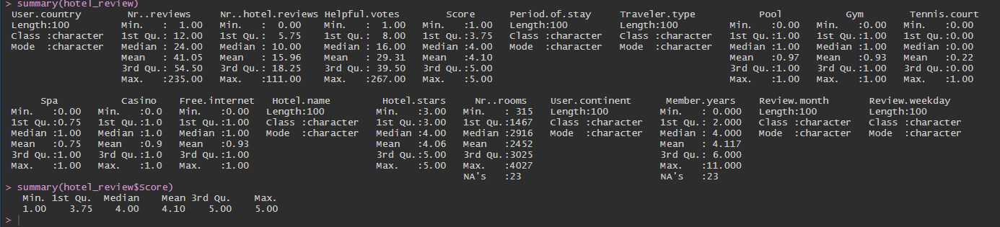
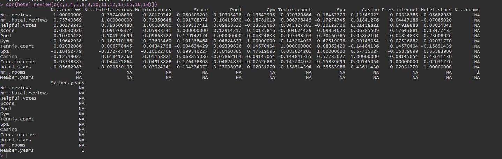
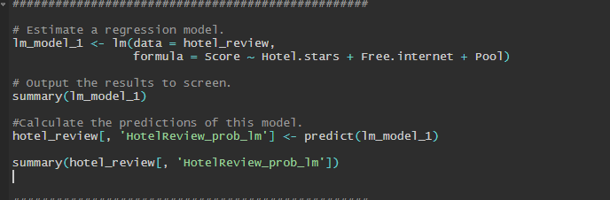
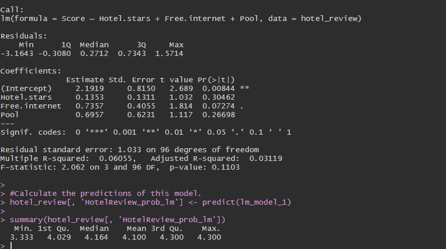
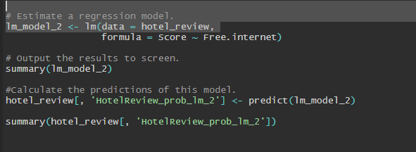
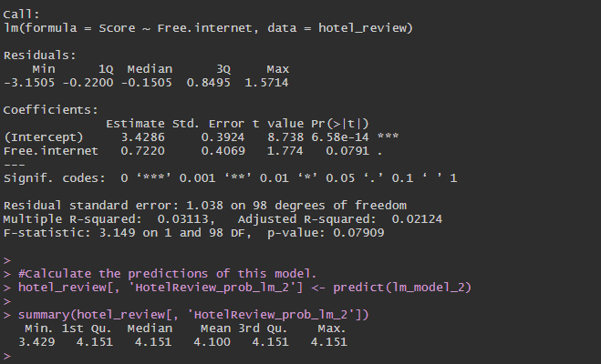

# Term Project Analysis
# Emeli Castellon & Lara Willson
## User Demographics and Resort Factors Effect on User Resort Scores

##Project Plan

For this project, we wanted to look into a dataset that related to the hospitality industry. We found a 2015 TripAdvisor dataset on Kaggle that we were interested in analyzing. The dataset presents information about reviews left on 21 different hotels in Las Vegas, including user information and hotel amenities. 

We found the dataset on Kaggle <a href="https://www.kaggle.com/crawford/las-vegas-tripadvisor-reviews">here</a>. The original dataset is located <a href="https://archive.ics.uci.edu/ml/datasets/Las+Vegas+Strip#">here</a>.

Below is an outline of the variables included in the dataset:

	• User Country : String
	• Number of Reviews : Quantitative
	• Number of Hotel Reviews : Quantitative
	• Helpful Votes : Quantitative
	• Score : Quantitative
	• Period of Stay : String
	• Traveler Type : String
	• Pool : Boolean
	• Gym : Boolean
	• Tennis Court : Boolean
	• Spa : Boolean
	• Casino : Boolean
	• Free Internet : Boolean
	• Hotel Name : String
	• Hotel Stars : Quantitative
	• Number of Rooms : Quantitative
	• User Continent : String
	• Member Years : Quantitative
	• Review Month : String
	• Review Weekday : String

Looking at the data  points included in our dataset, instinctually, we wanted to use the Review Score data point as the dependent variable. From a business perspective, Review Scores are very impactful to customers, especially in the hospitality industry, so being able to use regression theory to understand the impact various factors have on the resulting Review Score can be a powerful tool to drive higher reviews.

To conduct our initial analysis, we take a 100 record sample from the larger dataset to analyze. This way we leave enough independent samples to test any regressions we create.

##Step 1

The first thing we do is import the data sample and take a look at the summary.  We want to verify that there are no problems with the data and get a brief summary of what our data looks like. 

From this first glance, there are a few things about the structure / data types that we notice about some of the variables. For the boolean fields, the data is that has been imported is YES or NO. For our analysis, we are going to convert those to 0 or 1 respectively. Additionally, some that contain string data, may contain usable correlations / information for our analysis - Period of Stay or Traveler Type for example, so we need to make sure that we consider the non-quantitative factors as well.

##Step 2

We continue to take a quick, high-level glance at our data - including a histogram and a few additional stats on our dependent variable - Score.

##Step 3

The next think we wanted to do was clean up our data. We made sure all of our columns were defined appropriately with their respective datatypes. This step includes adjusting the boolean fields from Yes/No data types to 0/1 datatypes. After that, we verify the adjustments were made to the dataypes and the data.

##Step 4

Now we start to dive deeper into our analysis. We want to take a quick look to determine whether there are any relevant correlations between our numerical data points. We want to take note of any data points that are highly correlated (positively or negatively) as these are likely fields we can use when creating our regression.

The first thing we notice is the fact that the Number of Rooms and Member Years data points are not providing any information when looking at their correlations to the other fields. I pulled up the data to see what would cause this, and it appears not all of the data records contain that information. As a result, we can't really build anything using those data points, as they are not consistent or reliable. 

We are most interested in the Score variable, as that is what we were hoping to use for our dependent variable in our analysis. Looking at the correlations between that variable and all of the other numeric variables, doesn't indicate that there are really any strong correlations between the Score and the other data points for us to really lean on in our analysis.

There are a few data points that show a slight positive correlation between each other: Number of Reviews & Number of Hotel Reviews, Number of Reviews & Helpful Votes, Number of Hotel Reviews & Number of Helpful Votes. It makes complete sense that these data points would have some correlation - as the more reviews a user leaves or the more hotel reviews a user leaves, the more likely they are to have people mark their reviews as helpful. If you don't leave a review, no one can mark it helpful. So while these correlations exist, it is unlikely they can support any type of regression model useful in a business sense. 

##Step 5

Even though none of the quantitative variables had strong correlations to our dependent variable, we want to try creating a linear and logistic regression, so we could take a look at the statistics of the best regressions we could find at this point.

The three variables that had the highest correlation with the Score (dependent) variable are  Free Internet, Hotel Stars, and Pool; thus, that is where we start with our linear regression model. 

We build the model:

And run the summary to look at the statistics:

Looking at the t values and p values, the only variable that appears to be remotely close to significant is free internet.  Additionally, the r-squared value indicates that the model is not particularly successful. 

##Step 6

Knowing the Hotel Stars and Pool variables are not helping the model at all we go ahead and remove those variables and run the model and summary again. The results are very similar, the r-squared value again indicates our best model is not a successful one.

When in Vegas, would we put our money on the best regression we could come up with to predict Vegas Hotel Review Scores? Probably not. 

Citation: 

Moro, S., Rita, P., & Coelho, J. (2017). Stripping customers' feedback on hotels through data mining: The case of Las Vegas Strip. Tourism Management Perspectives, 23, 41-52.

From <https://archive.ics.uci.edu/ml/datasets/Las+Vegas+Strip#> 

