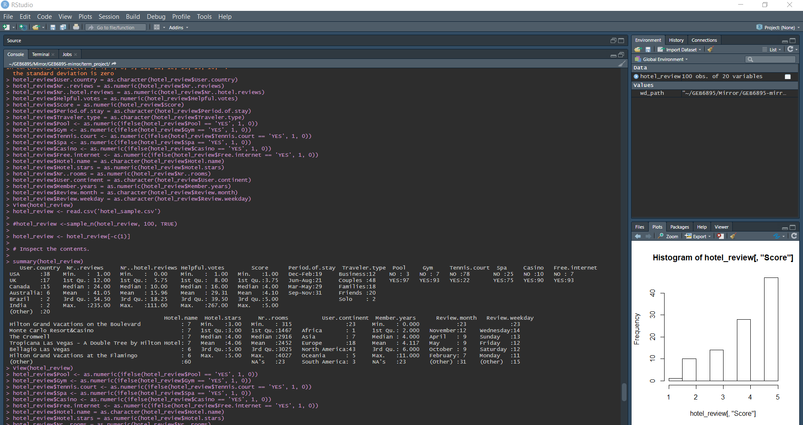
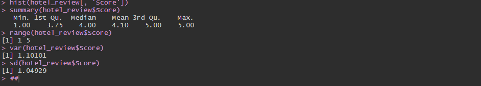
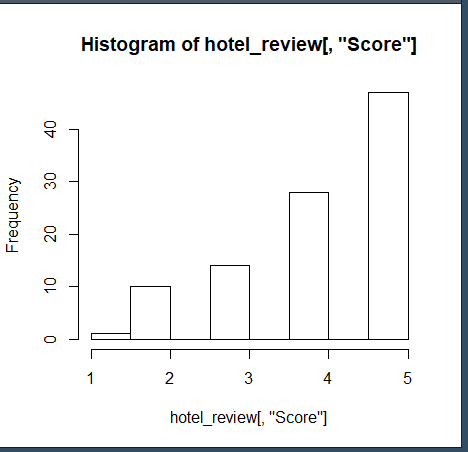
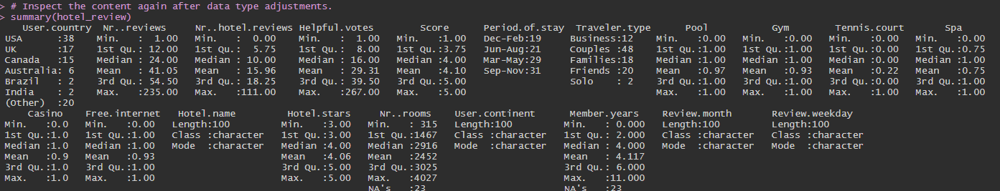
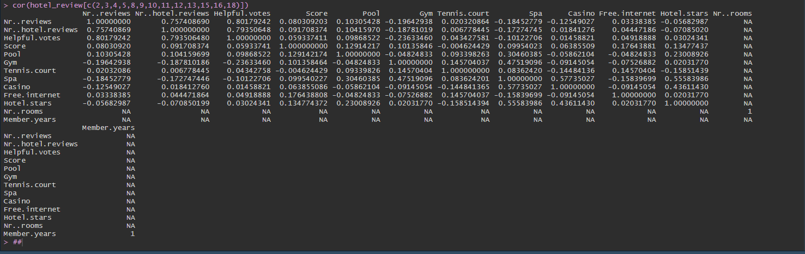

# Term Project Analysis
## Emeli Castellon & Lara Willson
## User and Resort Factors Effect on User Resort Scores

### 1.) A sample of the data, to clearly show the format of the variables. A hundred observations or so should be enough without pushing a large data file to your repo. 

### 2.) A preliminary analysis of the dependent variable. Show some summary statistics of the variable you would like to explain or predict. Plot a histogram of the variable if it is a continuous variable. 

#### Dependent Variable Analysis - User Review Score 

#### Score Variable Histogram

### 3.) Summary statistics for your explanatory variables. 

### 4.) An analysis of the correlation of your explanatory variables. Show a correlation matrix and identify any with unusually high correlation with each other.

#### The dependent variable we were planning on using - score - doesn't have any variables that appear to be strongly correlated - positively or negatively. Looking at the data though, there are some other variables that show to have some amount of correlation to look further into. Number of Hotel Reviews to Helpful Votes, Helpful Votes to Number of User Reviews. 